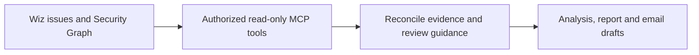
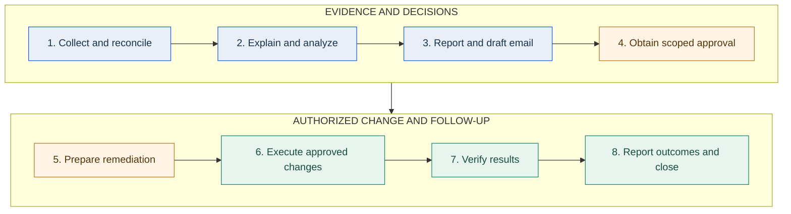

<div align="center">

# Cloud Security Remediations

### From Wiz findings to clear reports and scoped remediation decisions.

**Bring your CSVs. Understand the evidence. Coordinate the next step.**

Python 3.12+ &nbsp; | &nbsp; AWS + Azure &nbsp; | &nbsp; Local CSV processing &nbsp; | &nbsp; Human-reviewed changes

[Quick start](#quick-start) &nbsp; / &nbsp; [What you get](#what-you-get) &nbsp; / &nbsp; [Wiz MCP](#how-we-use-wiz-mcp) &nbsp; / &nbsp; [Workflow](#eight-stage-remediation-workflow) &nbsp; / &nbsp; [Guides](#documentation)

</div>

---

## Less spreadsheet cleanup. More useful security conversations.

Wiz identifies the finding. This project helps turn its evidence into a readable
report, a practical review and a traceable follow-up.

| **Understand the scope** | **Make the review easier** | **Keep decisions separate** |
| :--- | :--- | :--- |
| Consolidate repeated relationships without inflating identity or credential counts. | Present resource details, permission evidence and matched Wiz issue links in Excel. | Track progress without confusing approval, execution and verified closure. |

> [!IMPORTANT]
> **Start with the supported input:** AWS/Azure privileged-credential graph CSVs.
> This is not an importer for every Wiz control. Other finding types need a
> reviewed case-specific process.

## Quick start

**Requirements:** Python 3.12 or newer. Run from the project folder in PowerShell.

### 1. Set up once

```powershell
python -m venv .venv
.\.venv\Scripts\python.exe -m pip install -e .
```

### 2. Point to your export

```powershell
.\.venv\Scripts\python.exe -m remediation "C:\Exports\graph.csv" `
  --output "C:\Reports\finding.xlsx"
```

### 3. Open the report and review

Your workbook contains **Cover**, **AWS Data**, **Azure Data** and **Remediation**.
Use it to review the evidence and discuss the proposed approach with owners.

**Have the matching issue export too?** Add severity, lifecycle status and Wiz links:

```powershell
.\.venv\Scripts\python.exe -m remediation "C:\Exports\graph.csv" `
  --issues "C:\Exports\issues.csv" --output "C:\Reports\enriched-finding.xlsx"
```

Replace the example paths with your own. Inputs and outputs belong **outside the
checkout**; output paths must be absolute. Existing files are not overwritten by
default. The issue CSV supplements the graph CSV, not replaces it; mismatched or
conflicting evidence is rejected.

## What you get

### Three local tools, one reviewed workflow

| Tool | You provide | You receive |
| :--- | :--- | :--- |
| **CSV report** | Supported graph exports; optional matching issue CSVs | Four-tab Excel report with consolidated evidence and proposed guidance |
| **Workflow tracker** | Operator-reviewed progress and evidence references | Private per-finding/scope JSON history and an eight-stage status view |
| **Execution follow-up** | Existing local-account workbook and supported saved results | Updated completion/blockers, private execution memory and a plain-text email draft |

### The broader deliverable experience

The human/approved-chat workflow also prepares:

- **Visual analysis HTML** to explain the issue, access relationships and practical options.
- **Concise stakeholder email HTML** with a separate copyable body and plain-text companion.
- **Case-specific reports** when the default credential schema is not appropriate.

These are reviewed deliverable conventions, **not automatic general-purpose
analysis or HTML generation in the CLI**. Direct read-only Wiz collection uses
authorized Wiz MCP tools when available, not a built-in CLI integration.

> [!NOTE]
> The tool does not send emails, create tickets, execute cloud changes or track
> Wiz closure. ServiceNow remains authoritative for approvals, changes and closure.

## How we use Wiz MCP

**Less manual exporting. More context behind the finding.**

Wiz MCP (Model Context Protocol) lets an authorized assistant access the Wiz tools
exposed by a configured MCP server. In our assistant-led workflow, we use these
tools for **read-only evidence collection and investigation**, then review the
results before preparing deliverables.



| Step | How we use it | What we check |
| :--- | :--- | :--- |
| **Find the scope** | Retrieve issues for the selected control and account/project/status filters | Observation times, pagination and retrieval limits |
| **Understand the rule** | Review available rule configuration and one or two representative issue details | Summary, investigation and recommendations; expand the sample when configurations differ |
| **Trace relationships** | Retrieve associated identities, permissions, resources and relevant data-finding metadata | Stable IDs, optional relationships, distinct access paths and field coverage |
| **Reconcile and explain** | Review saved responses, deduplicate relationships and tailor applicable guidance | Counts, evidence gaps, existing safeguards and workload dependencies |

The last step is our review process, not a guarantee supplied by MCP. AI-generated
investigation remains a hypothesis to evaluate, and samples do not establish
complete inventory coverage.

<details>
<summary><strong>Connection requirements, fallback and product boundaries</strong></summary>

- An approved assistant/chat environment must already have a configured Wiz MCP
  server, authorized authentication and suitable read permissions. This repository
  does not install or configure that connection.
- Available tools and fields depend on the server and permissions. Verify what
  is exposed; do not assume every UI section, custom column or rule definition
  has an API equivalent.
- If direct retrieval is unavailable, use paired issue and Security Graph
  exports. The Python CLI accepts only its supported credential CSV schema;
  arbitrary MCP responses are not direct CLI inputs. Other controls use a
  reviewed case-specific process.
- Keep raw responses and client identifiers in approved private storage. Do not
  collect secret values or sensitive record samples just to enrich a report.
- MCP access is not remediation approval. Our use here does not execute fixes,
  change issue statuses, send messages or close tickets.

</details>

**Where the integration lives:** in the authorized assistant environment.
**What this repository provides:** local reporting, tracking, execution follow-up
and the [review process](docs/WORKFLOW.md) that turns evidence into useful outputs.

## Eight-stage remediation workflow

**Understand first. Agree the scope. Then change and verify.**
The diagram describes the human-reviewed process, not eight automated features.



| Phase | The question it answers | Required outcome |
| :--- | :--- | :--- |
| **1-2 / Understand** | What is affected, why does it matter, and what is actually supported by evidence? | Reconciled issue + graph scope, plain-English analysis and feasible options |
| **3-4 / Agree** | What should change, who authorizes it, and what must stay untouched? | Reviewed report/email, Security-created ticket and exact decisions/exclusions |
| **5-6 / Act** | How can the approved change be made safely? | Current-state checks, dependency/recovery plan and scoped operator execution |
| **7-8 / Confirm** | Did it work, and are the closure criteria met? | Technical and owner validation, fresh Wiz evidence and an authoritative disposition |

**No shortcuts:** approach agreement is not execution authorization; an applied
change is not verified closure; risk acceptance is not technical remediation.
Missing material evidence blocks validated analysis and final reporting.
Stop execution on unexpected failures or scope differences.

### Guided by Wiz. Refined for the environment.

1. **Read the rule** and initially open one or two representative issues for
   their summary, investigation and remediation guidance.
2. **Check the evidence.** Expand the sample for different configurations;
   sampling never replaces complete inventory, pagination or count reconciliation.
3. **Filter recommendations:** adopt, adapt, omit or defer, with a reason.
   Account for existing safeguards, shared dependencies and required access.
4. **Keep outputs aligned.** Explain the reasoning in the learning page; give
   stakeholders the concise applicable recommendation and approval request.

Wiz AI-generated investigation is context to evaluate, not proof of an attack.
See the [full workflow and communication guide](docs/WORKFLOW.md).

## Useful options

<details>
<summary><strong>Report flags and safe in-place updates</strong></summary>

| Option | Purpose |
| :--- | :--- |
| `--issues PATH` | Add matching issue metadata; repeat for multiple issue files |
| `--as-of YYYY-MM-DD` | Set the UTC age/expiry calculation date; defaults to today, not evidence freshness |
| `--notes PATH` | Include local text as a comment on the Remediation title |
| `--workflow PATH` | Retain a matching tracker snapshot in the Cover A21 cell note, not the visible summary |
| `--update` | Regenerate an existing tool-created workbook at the explicit `--output` path |
| `--help` | Show all options |

**Close Excel before updating.** `--update` rebuilds all four tabs and
**replaces manual workbook edits**. Keep source CSVs and approved decisions
separately. Reuse `--as-of` to preserve the calculation date.

</details>

## Track the current stage

Keep one private tracker per **finding and scope**, independent of CSV schema
support. See the current stage, last update, blocker, next action and required
completion references without putting internal workflow notes into executive prose.

<details>
<summary><strong>Create a tracker, view progress and record a blocker</strong></summary>

```powershell
.\.venv\Scripts\python.exe -m remediation workflow init `
  --tracker "C:\PrivateReports\finding.workflow.json" `
  --finding-id "example-case" --control-id "example-control" `
  --scope "Example project; Open and In Progress; agreed observation window" `
  --summary "Initial lookup only; full collection outstanding." `
  --next-action "Collect both sources and reconcile their scope."

.\.venv\Scripts\python.exe -m remediation workflow show `
  --tracker "C:\PrivateReports\finding.workflow.json"

.\.venv\Scripts\python.exe -m remediation workflow record `
  --tracker "C:\PrivateReports\finding.workflow.json" --stage 1 --status blocked `
  --summary "Issue collection is partial." --blocker "Graph evidence unavailable." `
  --next-action "Restore read-only access and finish collection."
```

Completion requires `--status complete` and a separate
`--evidence GATE=REFERENCE` for **every** current-stage gate. The CLI validates
reference presence, **not their truth or approval authority**. Human review is
required; blockers must be resolved before advancing one stage.

History is retained, existing trackers are not overwritten by initialization,
and completed stages cannot be reopened through this CLI. Workflow completion
does not necessarily mean technical remediation.
See [completion references and follow-up rules](docs/WORKFLOW.md#tracker-completion-references).

</details>

<details>
<summary><strong>Attach a tracker snapshot to a supported CSV report</strong></summary>

Add `--workflow` to the report command. Supply matching issue evidence or an
explicit `--rule-id` matching the control, and manually verify account/project/
time-window scope. A matching control alone is not enough.

The **Cover A21 comment only** retains the stage, update time, case/scope and
status detail. Its snapshot includes a draft qualification for stages 1-2.
Regenerate with the flag to refresh it; omitting the flag during regeneration
removes a prior snapshot. The visible stakeholder response request stays intact.

Generating a report never advances the tracker. No extra worksheet or live
dashboard is added. In approved chat, read the saved tracker before displaying
progress at stage changes or on request. Local-account execution memory remains
a separate record.

</details>

## Update completed work and blockers

Already have an approved local-account report? Import saved execution evidence
without manually rewriting every status.

```powershell
.\.venv\Scripts\python.exe -m remediation update-remediation `
  --report "C:\Reports\local-account-report.xlsx" `
  --result "C:\Evidence\run-result.txt" `
  --email-output "C:\Reports\stakeholder-update.txt"
```

> [!IMPORTANT]
> This uses a **different workbook schema**: AWS Data, Azure Data, Pending Review
> and Pending Remediation, with optional Cover. The four-tab credential report
> from the quick start is deliberately not accepted.

<details>
<summary><strong>Supported evidence, blockers and preservation rules</strong></summary>

- The report must contain explicit approved usernames; authorization still
  requires review through the change process.
- Repeat `--result` for multiple files. Only supported marker-based account-removal
  output is accepted, not arbitrary scripts or "Enable succeeded" alone.
- Partial results retain their verified subset and blockers; already-absent
  accounts do not count as new removals.
- Columns are matched by header. Pending views, blocker reasons and next actions
  are updated without treating them as extra resources.
- Raw output and deduplication history stay beside the workbook in
  `local-account-report.remediation-memory.json`, **not in Excel or the email**.
  Keep the report and memory together.
- Close Excel first. Updates retain a uniquely named pre-update workbook backup
  and refuse to overwrite an existing email draft.
- Use `--blockers "C:\Evidence\blockers.csv"` for reviewed manual blockers or
  an explicit return to the original pending status.
- Use `--email-only` instead of result/blocker inputs to draft from current
  records without changing the workbook or memory.

The email is a **plain-text draft** summarizing recorded completions, exclusions
and remaining work. Review recipients, facts, ticket reference and attachment
before sending. No fresh Wiz reassessment or closure is performed.

See the [execution follow-up guide](docs/EXECUTION.md) for schemas, matching rules
and supported result markers.

</details>

## Private evidence. Public reusable tooling.

| Keep outside this repository | Keep in this repository |
| :--- | :--- |
| Client exports, identifiers, screenshots and reports | Reusable application code |
| Analysis/email pages, approval records and execution logs | Client-neutral workflow documentation |
| Credentials, secrets and operational backups | Synthetic tests and publication checks |

Organize private deliverables by issue/campaign, with shared context kept
separately. This is a workflow convention, not automatic CLI folder routing.
CSV processing is local; **workbooks and local execution memory are not encrypted**.
Use approved storage, access controls and retention.

## Documentation

| I want to... | Start here |
| :--- | :--- |
| Understand evidence, analysis and stakeholder communication | [Workflow guide](docs/WORKFLOW.md) |
| Import execution results or manage blockers | [Execution follow-up](docs/EXECUTION.md) |
| Develop, validate or publish changes safely | [Publication guide](docs/PUBLICATION.md) |

## Developer & Maintainer

**[Prashant Kumar](https://github.com/PrashantAHD)**  
Cloud Security Engineer @AHEAD

[GitHub](https://github.com/PrashantAHD) &nbsp; | &nbsp; [LinkedIn](https://www.linkedin.com/in/iprashantkr)

---

**Evidence before conclusions. Scoped approval before changes. Verification before closure.**
